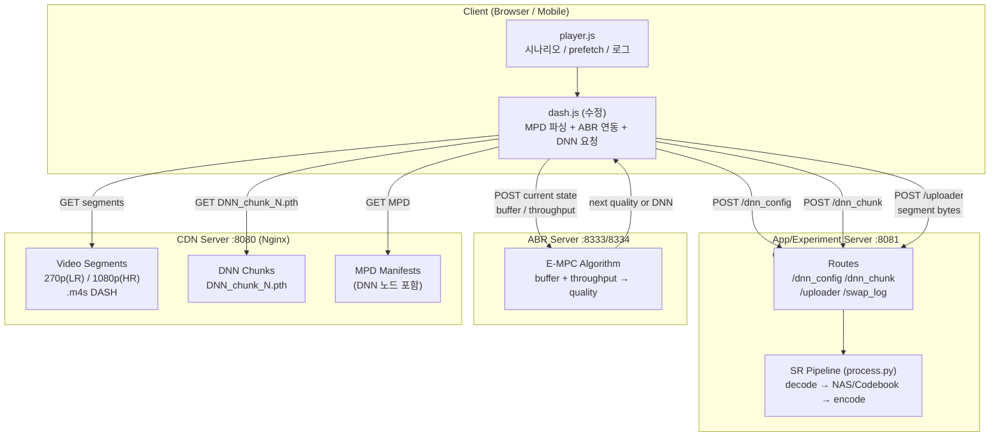
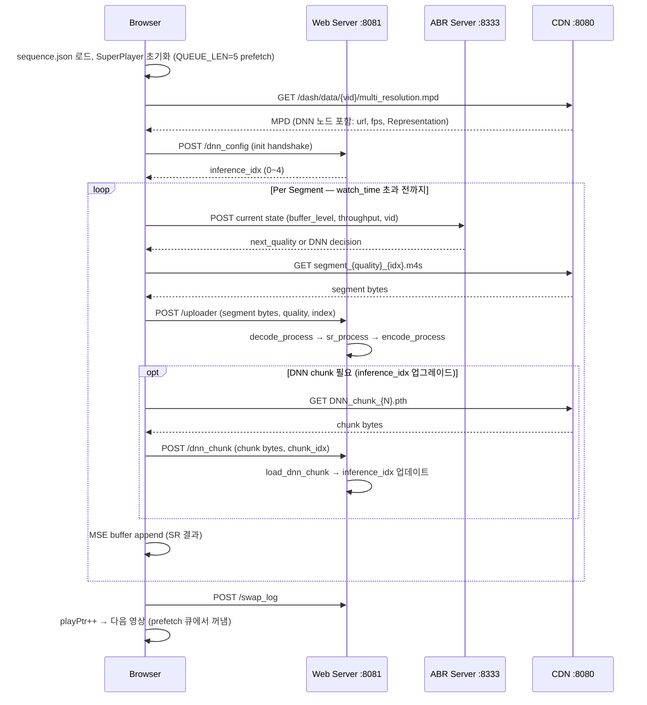
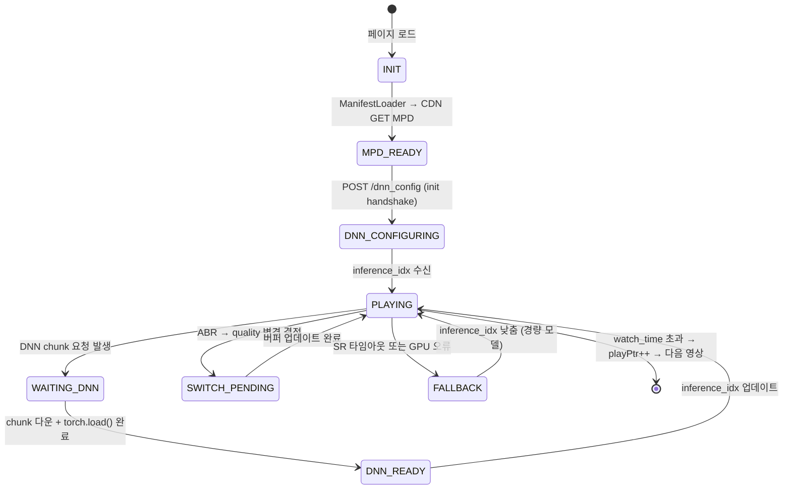

# GUIDE: Architecture, Setup, and Experiment

> **대상**: 연구팀 내부. ML/스트리밍 도메인 지식 전제. 코드 레벨 세부사항 포함.

---

## Part 1. Background & Motivation

### 1.1 NAS_demo 기반 구조

[kaist-ina/NAS_demo](https://github.com/kaist-ina/NAS_demo)는 **데스크탑 클라이언트(NVIDIA GPU 필요)** 가정:
- Client: Ubuntu 18.04+, Chrome, NVIDIA RTX 2080Ti
- 네트워크 시뮬레이션: `tc` (Linux traffic control), 예) 0.9Mbps 제한
- SR 추론: 클라이언트 GPU에서 실시간 수행
- ABR schemes: NAS (RL), Pensieve (RL), Robust MPC, Buffer-based
- 실행 구조:
  ```bash
  sudo systemctl start nginx

  cd abr-server
  python dnn_custom_server_mpc.py 

  cd web-server_www
  python dnn_appLocalServer.py --quality ultra 
  
  # web-server_www/static/sequence.json
  # 브라우저 (Chrome) : http://163.152.162.202:8081/
  ```

### 1.2 왜 Dashlet + NAS를 결합했나

- **NAS_demo 한계**: 단일 영상 연속 재생 가정 → Shorts는 짧은 영상이 빠르게 전환됨
- **Dashlet 기여 (NSDI'23)**:
  - Swipe 불확실성 대응 prefetch 큐 (`QUEUE_LEN=5`)
  - `watch_time` 기반 조기 전환: 영상 끝까지 안 보고 swipe
  - Oracle 대비 77–99% QoE, TikTok 대비 43.9–45.1× 낭비 bytes 절감
- **결합 목적**: Shorts 환경에서 SR+ABR 통합 실험 가능한 단일 테스트베드 구성

### 1.3 Mobile Client로의 전환 (왜 중요한가)

- **NAS 한계**: 클라이언트 GPU 필요 → 실제 모바일 배포 불가
- **Codebook Switching 방향**:
  - Stage 2 KNN 클러스터링 → per-cluster codebook → 소용량 (모바일 사전 배포)
  - Decoder + Coarse-SR: CPU 추론 가능 (PyTorch Mobile / ExecuTorch)
- **전송 절감**: 270p LR만 전송 → 클라이언트에서 x4 복원 → 1080p 출력
- **선행 연구 참조**: NEMO (MobiCom'20) — Android ExoPlayer + SR codec, NEMO 저자 = NAS 저자 동일 그룹

---

## Part 2. System Architecture

### Figure A. 전체 시스템 아키텍처



---

### Figure B. 재생 시퀀스 다이어그램



---

### Figure C. 상태 머신



---

## Part 3. Component Details

### 3.1 player.js — Browser App Layer

**파일**: `web-server_www/static/js/player.js`

- `sequence.json` → `[{pid, watch_time, duration}, ...]` 기반 플레이리스트
- `playPtr`: 현재 재생 인덱스 / `nextPreloaderPtr`: prefetch 선행 포인터
- `QUEUE_LEN = 5`: 최대 5개 영상 사전 로드
- `window.DNN_STATE.byVid[vid]` / `byPlayerIdx[idx]`: 전역 DNN 상태 레지스트리
- 핵심 호출 체인:
  ```javascript
  player.attachSource(mpd_url)   // prefetch 큐 등록
  player.playNext()              // 다음 영상으로 전환
  ```

---

### 3.2 dash.js 수정 사항

**파일**: `web-server_www/static/js/dash.all.debug.js`

#### 컴포넌트 싱글턴 vs 인스턴스 구분

```
SuperPlayer
└─ MediaPlayer          (인스턴스)
   └─ ManifestLoader    (인스턴스)
   └─ PlaybackController (싱글턴)
   └─ StreamController  (싱글턴)
      └─ Stream         (인스턴스)
         └─ FragmentController  (인스턴스)
            └─ FragmentModel    (인스턴스)
            └─ FragmentLoader   (인스턴스)
         └─ StreamProcessor     (인스턴스)
            ├─ BufferController           (인스턴스)
            ├─ RepresentationController   (인스턴스)
            └─ ScheduleController         (인스턴스)
```

#### DNN 컨텍스트 객체

```javascript
// ManifestLoader::load 에서 per-vid 생성
window.DNN_STATE.byVid[vid] = createDnnContext({ vid, dnnNode, fps });
// playerId 포인터 레지스트리
window.DNN_STATE.byPlayerIdx[playerId] = context;

function createDnnContext({ vid, manifest, fps }) {
    return {
        vid, manifest, fps,     // 고정 정보 (MPD DNN 노드에서 파싱)
        SR_buffer: [],          // 업로드 대기 세그먼트 목록
        DNN_requests: [],       // 진행 중인 DNN 요청
        complete: false,
        set_interval: null,
        reqType: null,          // "DNN" | "video" — ScheduleController가 결정
        reqByte: null,
        resByte: null,
        rebuf_start: null
    };
}
```

#### 전역 플래그 (window.*)

```javascript
window.SRProcess_enabled    // SR 파이프라인 활성화 여부
window.DNNTest_enabled      // inference_idx 자동 결정 활성화
window.DNN_download_enabled // DNN chunk 다운로드 게이트
window.partial_dnn_enabled  // 부분 DNN(일부 chunk만) 허용
window.DNN_selection        // 선택된 inference layer (0~4)
```

#### MediaPlayer 추가 메서드

```javascript
enableSRProcess()           // SRProcess + DNNTest + DNN_download 모두 활성화
disableSRProcess(quality)   // SR 비활성화, quality 고정
enablePartialDNN()          // partial_dnn + DNN_download 활성화
disableDNNTest()            // inference_idx 자동 테스트 비활성화
```

#### 컴포넌트별 DNN 연동 포인트

| 컴포넌트 | 수정 내용 |
|---------|---------|
| `ManifestLoader` | MPD의 DNN 노드 파싱 → `createDnnContext()` 생성, `/dnn_config` POST |
| `MediaPlayer` | `enableSRProcess()` 등 DNN 제어 메서드 추가; `AbrController`에 `mediaPlayer` 인스턴스 전달 |
| `ScheduleController` | `downloadFinishNotification()` → `dnnCtx.reqType` 결정; `send_DNN_Request_chunk()` |
| `FragmentController` | `send2DNNprocess()` → SR buffer 큐잉; `onFragmentLoadingCompleted()` 에서 dnnCtx 참조 |
| `BufferController` | `updateBufferLevel()` → `dnnCtx.bufferLevel` 업데이트 |
| `AbrController` | `setConfig({ mediaPlayer: instance })` — 플레이어 인스턴스 수신 |

---

### 3.3 dnn_appLocalServer.py — Flask Server

**파일**: `web-server_www/dnn_appLocalServer.py`

| Route | Method | 역할 |
|-------|--------|------|
| `/dnn_config` | POST | inference layer 결정 + time-budget 테스트 → `inference_idx` 반환 |
| `/dnn_chunk` | POST | weight chunk 수신 → `downloads/{vid}/DNN_chunk_N.pth` 저장 → `dnn_queue` 삽입 |
| `/uploader` | POST | 세그먼트 수신 → `decode_queue` 진입 (SR 파이프라인 트리거) |
| `/swap_log` | POST | 모델 스왑 이벤트 로깅 |
| `/uploadPlayback` | GET | 재생 메트릭 수집 |
| `/uploadRebuffer` | GET | 리버퍼링 이벤트 수집 |

---

### 3.4 SR Pipeline — process.py

**파일**: `web-server_www/super_resolution/process.py`

멀티프로세스 + 스레드 구조:

```
decode_process:
  m4s(init + media) merge → OpenCV 프레임 읽기
  → CUDA shared tensor[height][frame_idx % SHARED_QUEUE_LEN(=120)]
  → data_queue.put(('frame', frame_count))

load_dnn_chunk [thread]:
  dnn_queue 메시지 처리:
  ├─ 'model'     : 전체 checkpoint torch.load()
  ├─ 'dnn_chunk' : DNN_chunk_N.pth → model.load_state_dict(strict=False) → inference_idx 갱신
  └─ 'test_dnn'  : inference_time vs frame_duration 측정 → 최적 inference_idx 결정

process_video_chunk [thread]:
  model(input_tensor, inference_idx) → SR frame
  → shared_tensor[1080p][idx % SHARED_QUEUE_LEN]
  → encode_queue.put(('frame', idx))

encode_process:
  FFMPEG rawvideo → h264 @ ultrafast
```

**DNN 청크 ↔ inference_idx 매핑**:

| 파일 | inference_idx | 품질 |
|------|:---:|------|
| `DNN_chunk_1.pth` | 0 | 최경량 (~2MB, low) |
| `DNN_chunk_2.pth` | 1 | — |
| `DNN_chunk_3.pth` | 2 | — |
| `DNN_chunk_4.pth` | 3 | — |
| `DNN_chunk_5.pth` | 4 | 최고품질 (~30MB, ultra) |

---

### 3.5 NAS 모델 — model/NAS.py

**파일**: `web-server_www/super_resolution/model/NAS.py`

- `Multi_Network`: scale 1x / 2x / 3x / 4x 지원, `scale_dict = {1:3, 2:2, 3:1, 4:0}`
- `Single_Network`: ResBlock × N layers, `outputFilter`로 중간 exit 지점 노출
- `forward(x, inference_idx)`: 지정 층에서 조기 출력 → 속도/품질 트레이드오프
- Quality tier: `low` / `medium` / `high` / `ultra`

---

### 3.6 ABR Server

**파일**: `abr-server/empc_server_dashlet.py`

- 알고리즘: E-MPC (Enhanced Model Predictive Control)
- 입력: `buffer_level`, `throughput`, `vid`
- 출력: `next_quality` (0=270p / 1=360p / 2=540p / 3=1080p) 또는 DNN 다운로드 결정
- 실행 옵션:

```bash
python empc_server_dashlet.py  # 기본 E-MPC
# 알고리즘 변경 시 abrAlgorithmCollection*.py 참조
```

---

## Part 4. Setup

### 4.1 Prerequisites

| 항목 | 현재 (NAS testbed) | 향후 (Mobile) |
|------|:-----------------:|:------------:|
| Client OS | Ubuntu 18.04+ | Android |
| Client GPU | NVIDIA RTX 2080Ti 이상 | 불필요 (CPU 추론) |
| SR 추론 위치 | 클라이언트 GPU | 클라이언트 CPU |
| 네트워크 에뮬레이션 | `tc` | **Mahimahi** |
| 가상 디스플레이 | Xvfb | Android ADB |

### 4.2 Python 환경

```bash
conda create -n dashlet python=3.8
conda activate dashlet
pip install -r web-server_www/requirement.txt
# PyTorch (CUDA 버전에 맞춰 설치)
pip install torch torchvision --index-url https://download.pytorch.org/whl/cu118
```

### 4.3 Nginx 설정 파일 구조

시스템 nginx (`/etc/nginx/`) 사용. 두 개의 설정 파일이 `sites-available/` 에 있고 `sites-enabled/`에 symlink로 활성화되어 있어야 한다.

```bash
# 활성화 확인
ls -la /etc/nginx/sites-enabled/
# dashlet-cdn -> /etc/nginx/sites-available/dashlet-cdn
# abr-8333.conf -> /etc/nginx/sites-available/abr-8333.conf

# 없으면 symlink 생성
sudo ln -s /etc/nginx/sites-available/dashlet-cdn /etc/nginx/sites-enabled/
sudo ln -s /etc/nginx/sites-available/abr-8333.conf /etc/nginx/sites-enabled/
sudo nginx -t && sudo systemctl reload nginx
```

#### `dashlet-cdn` (포트 8080) — CDN 서버 **[필수]**

| Location | 역할 |
|----------|------|
| `/dash/data/{vid}/` | MPD 매니페스트, 해상도별 `.m4s` segment 서빙 |
| `/dash/model/{vid}/` | DNN 모델 chunk (`DNN_chunk_N.pth`) 서빙 |

이 파일이 없거나 비활성화되면 브라우저가 영상/MPD를 전혀 읽지 못한다.

#### `abr-8333.conf` (포트 8333 → 8334) — ABR 역방향 프록시 **[필수]**

`dash.js`는 ABR 결정을 위해 `window.location.hostname:8333`에 POST를 보낸다.
Python ABR 서버(`dnn_custom_server_mpc.py`)는 포트 **8334**에서 동작하며 자체적으로 `Access-Control-Allow-Origin: *`를 붙이지만,
nginx 8333 레이어가 이를 숨기고 허용 origin을 `http://{SERVER_IP}:8081`로 제한한다.

> **이 파일 없이 구동하려면**: `dash.all.debug.js`에서 8333 → 8334로 포트 번호 변경 후 nginx 없이 Python 서버 CORS(`*`)를 그대로 사용 가능.

#### CORS 허용 origin 변경 방법

서버 IP가 `163.152.162.202`가 아닌 경우, 두 파일 모두에서 IP를 교체해야 한다:

```bash
# 현재 허용 origin 확인
grep "Access-Control-Allow-Origin\|cors_allow_origin" \
  /etc/nginx/sites-available/dashlet-cdn \
  /etc/nginx/sites-available/abr-8333.conf

# IP 일괄 교체 (예: 새 서버 IP가 10.0.0.5인 경우)
sudo sed -i 's/163\.152\.162\.202/10.0.0.5/g' \
  /etc/nginx/sites-available/dashlet-cdn \
  /etc/nginx/sites-available/abr-8333.conf
sudo nginx -t && sudo systemctl reload nginx
```

#### 콘텐츠 배치

```
cdn-server/contentServer/dash/data/{vid}/{resolution}/init.mp4
cdn-server/contentServer/dash/data/{vid}/{resolution}/seg_{idx}.m4s
cdn-server/contentServer/dash/model/{vid}/ultra/DNN_chunk_{1..5}.pth
```

#### ⚠️ CORS 주의: 브라우저 접속 URL

nginx CORS는 `http://{SERVER_IP}:8081` origin만 허용한다.
**반드시 브라우저에서 실제 IP로 접속해야 한다:**

```
# 올바름 (origin = http://163.152.162.202:8081)
http://163.152.162.202:8081/

# CORS 오류 발생 (origin = http://localhost:8081)
http://localhost:8081/    ← SSH 터널 등으로 localhost 접속 시
```

`localhost`로 접속하면 `The 'Access-Control-Allow-Origin' header has a value 'http://163.152.162.202:8081' that is not equal to the supplied origin` 오류가 발생한다.

### 4.4 ABR Server

```bash
cd abr-server
python empc_server_dashlet.py
# 포트: 8333 (video ABR) / 8334 (DNN ABR)
```

### 4.5 App/Experiment Server

```bash
cd web-server_www
python dnn_appLocalServer.py --quality ultra --processMode scalable
# --quality: low | medium | high | ultra
# --processMode: runtime | scalable | mock | multi
```

### 4.6 sequence.json 설정

**파일**: `web-server_www/static/sequence.json`

```json
[
  {"pid": "10603",  "watch_time": 41.0, "duration": 55.466},
  {"pid": "12001",  "watch_time": 21.0, "duration": 38.7},
  {"pid": "100552", "watch_time": 39.0, "duration": 46.433}
]
```

- `pid`: CDN에 있는 비디오 ID (`dash/data/{pid}/`)
- `watch_time`: 해당 영상 시청 시간 (초) — 이 시간 초과 시 다음 영상으로
- `duration`: 실제 영상 총 길이 (초)

### 4.7 브라우저 접속

```
Chrome → F12 → Network 탭 → "Disable cache" 체크
http://localhost:8081
```

---

## Part 5. Mobile Testbed 구성 [ToDo]

### NEMO (MobiCom'20) 참조 구조

[kaist-ina/nemo](https://github.com/kaist-ina/nemo) — NAS 저자 동일 그룹, Android 모바일 SR 스트리밍 테스트베드.

| NEMO 모듈 | 역할 | 본 시스템 대응 |
|-----------|------|--------------|
| `video/` | 영상 다운로드 / 인코딩 | CDN segments 준비 |
| `nemo/dnn/` | 모델 학습 + Qualcomm SNPE 변환 | Codebook 학습 + PyTorch Mobile 변환 |
| `nemo/cache_profile/` | Anchor Point 선택 (`select_anchor_points.py`) | 클러스터 ID → 프레임 범위 매핑 |
| `player/` | Android ExoPlayer + SR 통합 codec | Android 클라이언트 기반 |
| `third_party/libvpx/` | SR 통합 VP9 디코더 (`vpxdec_nemo_ver2.c`) | 향후 codec 통합 참조 |

**Palantir (MMSys'25)** [Palantir-SR/palantir](https://github.com/Palantir-SR/palantir) — 서버 profile/cluster 생성 + 클라이언트 codec metadata 기반 선택적 SR 구조로 본 시스템 설계와 가장 유사.

### NEMO vs 현재 시스템 차이

| 항목 | NEMO / Palantir | 현재 (NAS/Codebook) |
|------|:---------------:|:------------------:|
| SR 위치 | 코덱 디코더 내 (libvpx 수정) | process.py 별도 파이프라인 |
| 추론 엔진 | Qualcomm SNPE SDK | PyTorch Mobile / ExecuTorch |
| 프레임 선택 | Anchor Point (GOP 기반) | inference_idx (레이어 기반) |
| 클라이언트 | Android ExoPlayer | Browser (DASH.js) → Android 확장 예정 |

### 필요 도구 (모바일 클라이언트 가정 시)

| 도구 | 역할 | 비고 |
|------|------|------|
| **Android Studio** | ExoPlayer 기반 플레이어 빌드 | NEMO `player/` 참조 |
| **Qualcomm SNPE SDK v1.40+** | Snapdragon NPU 추론 | TF → `.dlc` 변환 필요 |
| **PyTorch Mobile / ExecuTorch** | 범용 Android CPU 추론 | INT8, XNNPACK backend |
| **Android ADB** | 기기 연동 + 로그 수집 | Mahimahi UsbShell 연동 가능 |
| **ARM64 cross-compiler** | libvpx ARM64 빌드 | `nemo_client_arm64.sh` 참조 |
| **Mahimahi** | 네트워크 에뮬레이션 (LTE/5G 트레이스) | LinkShell + DelayShell 조합 |
| **Xvfb** | 헤드리스 브라우저 실행 | `sudo apt-get install xvfb` |
| **tc (traffic control)** | 간단한 대역폭 제한 | `tc qdisc add dev eth0 root tbf ...` |

```bash
# Mahimahi LTE 환경 예시 (2Mbps, 50ms RTT)
mm-link traces/ATT-LTE-driving.up traces/ATT-LTE-driving.down \
  mm-delay 25 \
  -- python web-server_www/dnn_appLocalServer.py
```

### Anchor Point ↔ Codebook 클러스터 연결 포인트

| NEMO/Palantir | 본 시스템 (Codebook) |
|:---:|:---:|
| Anchor point: GOP 내 SR 적용 프레임 결정 (quality_margin) | Cluster: 영상 content 특성 기반 적합 codebook 선택 |
| `select_anchor_points.py` (quality × GOP 탐색) | Stage 2 KNN histogram 클러스터링 |
| codec metadata로 클라이언트 전달 | CDN `dash/model/{vid}/{cluster_id}/` 경로로 전달 |

### 모바일 배포 시 process.py 변경 포인트

- `CUDA shared tensor` → CPU tensor (`share_memory_()` 제거)
- `inference_idx` → `codebook_cluster_id`로 대체
- `SHARED_QUEUE_LEN` 축소 (메모리 제한 대응)
- `model.cuda()` → `model.cpu()` + `torch.quantization.quantize_dynamic()`

---

## Part 6. Codebook Switching 통합 설계

### 6.1 현재 NAS vs Codebook 비교

| 항목 | 현재 (NAS) | Codebook Switching |
|------|:----------:|:-----------------:|
| 모델 아키텍처 | Multi_Network (ResBlock scalable) | tex-VQVAE + SRResNet (Temporal-fusion) |
| 클라이언트 요구사항 | NVIDIA GPU 필수 | CPU 가능 (모바일 배포 가능) |
| 모델 파일 | `DNN_chunk_N.pth` × 5 | `codebook_chunk_N.pth` × K (클러스터 수) |
| 선택 파라미터 | `inference_idx` 0~4 | `codebook_cluster_id` |
| `/dnn_config` 역할 | inference layer time-budget 테스트 | codebook capacity 테스트 |
| `process.py` 교체 위치 | `Multi_Network.forward(x, idx)` | `texVQVAE.forward(x, codebook_idx)` |
| 유지 인터페이스 | `/dnn_chunk`, `/dnn_config`, `/uploader` | **동일 유지** (최소 침습 원칙) |

### 6.2 학습 파이프라인

```
Stage 1: General SR 학습 (tex-VQVAE)
────────────────────────────────────
  모델: Encoder + Decoder + Codebook + Coarse-SR (SRResNet, Temporal-fusion)
  입력: 270p LR  →  출력: 1080p HR  (x4 upscaling)
  Temporal fusion: (frame t-1, t, t+1) 컨텍스트 활용
  데이터: 191,299 프레임
    - 79,770 SDR YouTube Shorts
    - 83,629 HDR-to-SDR 변환
    - 27,000 REDS benchmark
    -    900 DIV2K
  Loss: Reconstruction + Coarse-SR + Commitment + Entropy regularization
  Codebook 안정화: L2 normalization, dead-code replacement (500 iter마다)

Stage 2: 클러스터별 특화
────────────────────────
  Codebook histogram 기반 KNN Clustering → per-cluster codebook 생성
  Meta-learning (REPTILE) → 빠른 클러스터 adaptation
  결과: cluster_id → 소용량 codebook weight  (모바일 사전 배포 대상)
```

### 6.3 서버 → 클라이언트 전송 (Tx)

```
전송 영상  : 270p LR DASH segments  (h.264 / VP9)
전송 모델  : per cluster
  ├─ I-matrices (Encoder 중간값)
  ├─ Decoder 모델 1개
  └─ Coarse-SR 모델 1개

CDN 경로   : dash/model/{vid}/{cluster_id}/codebook_chunk_*.pth
```

> 시뮬레이션에서는 270p(LR)만 전송, HR(1080p)은 품질 평가용으로 서버에 보관.

### 6.4 클라이언트 배포 (After Stage 2)

```
사전 탑재  : quantize.embedding.weight per Cluster  (Pretrained Codebook)
재생 시    : Codec LR Decode → Decoder(i-matrix, coarse-sr) → 1080p SR
런타임     : PyTorch Mobile  (INT8 static quantization + XNNPACK backend)
구현 위치  : process.py  sr_process thread 내 model 교체
```

---

## Part 7. 실험 설정 및 평가 지표

### 7.1 실행 파라미터

```bash
# DNN 품질 선택
python dnn_appLocalServer.py --quality {low|medium|high|ultra}

# ABR 알고리즘 선택
python empc_server_dashlet.py        # E-MPC (기본)
# abrAlgorithmCollection*.py 내 알고리즘 교체 가능

# 네트워크 조건 (tc)
sudo tc qdisc add dev eth0 root tbf rate 900kbit burst 32kbit latency 400ms
```

### 7.2 평가 지표 (선행 연구 기준)

#### 화질 / 복원 품질

| 지표 | 우선순위 | 비고 |
|------|:-------:|------|
| **PSNR** | 필수 | NEMO·Palantir·EOS 모두 핵심 비교 기준 |
| **SSIM** | 필수 | 구조적 유사도 |
| **VMAF** | 권장 | Netflix 시지각 품질 (스트리밍 친화적) |
| LPIPS | 선택 | perceptual loss 기반 |

#### 실시간성

| 지표 | 측정 위치 | 참고 |
|------|---------|------|
| FPS / per-frame latency | `process.py` sr_process thread | NEMO: throughput |
| per-segment latency | `/uploader` 수신 → encode 완료 | NeuroScaler: E2E latency |
| scheduling latency | ABR 결정 → segment 요청 | Palantir: scheduling latency |
| startup latency | 브라우저 첫 재생까지 | Dashlet: startup delay |
| dropped frame 비율 | `BufferController` | — |

#### 에너지 / 배터리 (모바일 배포 시)

| 지표 | 도구 |
|------|------|
| average power (W) | Android Battery Stats / `powerstat` |
| energy per frame (J/frame) | 위 값 / FPS |
| thermal throttling onset time | CPU temperature monitor |

> NEMO: energy, battery life, surface temperature 직접 측정.
> EOS (MobiCom'25): average power reduction을 핵심 성과로 보고.

#### 스트리밍 / QoE

| 지표 | 현재 수집 여부 |
|------|:------------:|
| QoE (bitrate − rebuffer penalty − switch penalty) | `/uploadPlayback`, `/uploadRebuffer` |
| bandwidth saving at same QoE | 실험 비교 |
| quality switch frequency | `swap_log` |

#### 모바일 배포성

| 지표 | 측정 방법 |
|------|---------|
| model size (MB) | `codebook_chunk_*.pth` 합계 |
| peak RAM / RSS | Android Studio Profiler |
| cold-start / model load time | `/dnn_config` 응답 시간 |
| CPU / NPU utilization | Android Profiler / `top` |

### 7.3 Palantir 구조 참조 포인트

**[Palantir-SR/palantir](https://github.com/Palantir-SR/palantir)** (MMSys'25)는 본 시스템 서버→클라이언트 설계와 가장 유사:

| Palantir | 본 시스템 대응 |
|---------|--------------|
| 서버: per-chunk cache profile 생성 (anchor point selection) | Stage 2 KNN clustering → per-cluster codebook 생성 |
| 클라이언트: codec metadata 기반 선택적 SR 적용 | `process.py` decode 후 `cluster_id` → SR 추론 |
| libvpx + SNPE v1.68 통합 | 현재 process.py 분리 구조 → 향후 codec 통합 가능 |

---

## Part 8. Troubleshooting

| 증상 | 원인 | 해결 |
|------|------|------|
| CUDA OOM | `SHARED_QUEUE_LEN` 과다 | `MAX_FPS` / `MAX_SEGMENT_LENGTH` 축소 |
| 세그먼트 404 | CDN 경로 불일치 | `sequence.json` pid ↔ `cdn-server/.../dash/data/{pid}/` 확인 |
| DNN 로드 실패 | weight 불일치 | `torch.load(..., strict=False)` 확인 |
| SR 타임아웃 | 모델 너무 깊음 | `/dnn_config` → inference_idx 낮춤 (FALLBACK 상태) |
| Nginx 502 | CDN 미실행 | `nginx -t` 후 `sudo nginx` |
| CORS (`not equal to the supplied origin`) | 브라우저를 `localhost`로 접속 | `http://{SERVER_IP}:8081/`로 접속 (SSH 터널 localhost 금지) |
| CORS (서버 IP 변경 후) | nginx conf에 구 IP 잠존 | `sudo sed -i 's/OLD_IP/NEW_IP/g'` conf 두 파일 교체 후 `sudo systemctl reload nginx` |
| `getPlayerId is not a function` | FragmentController 중복 인스턴스 | StreamProcessor 내 FC는 `config.mediaPlayer` 세팅 필요 |

---

## References

```
[1] H. Yeo et al., "Neural Adaptive Content-aware Internet Video Delivery,"
    USENIX OSDI 2018, pp. 645–661.

[2] Z. Li et al., "Dashlet: Taming Swipe Uncertainty for Robust Short Video Streaming,"
    USENIX NSDI 2023, pp. 1583–1598.

[3] B. Guo et al., "LAR-SR: A Local Autoregressive Model for Image Super-Resolution,"
    IEEE/CVF CVPR 2022.

[4] H. Yeo et al., "NEMO: Enabling Neural-enhanced Video Streaming on Commodity Mobile Devices,"
    ACM MobiCom 2020. DOI: 10.1145/3372224.3419185

[5] "Palantir: Efficient Super Resolution for Ultra-high-definition Live Streaming,"
    ACM MMSys 2025. DOI: 10.1145/3712676.3714434
    GitHub: https://github.com/Palantir-SR/palantir

[6] S. Park et al., "EOS: Energy-Optimized Super-Resolution on Mobile Devices for Live 360-Degree Videos,"
    ACM MobiCom 2025. DOI: 10.1145/3680207.3765252

[7] H. Mao et al., "Neural Adaptive Video Streaming with Pensieve,"
    ACM SIGCOMM 2017. DOI: 10.1145/3098822.3098843

[8] R. Netravali et al., "Mahimahi: Accurate Record-and-Replay for HTTP,"
    USENIX ATC 2015.
```
