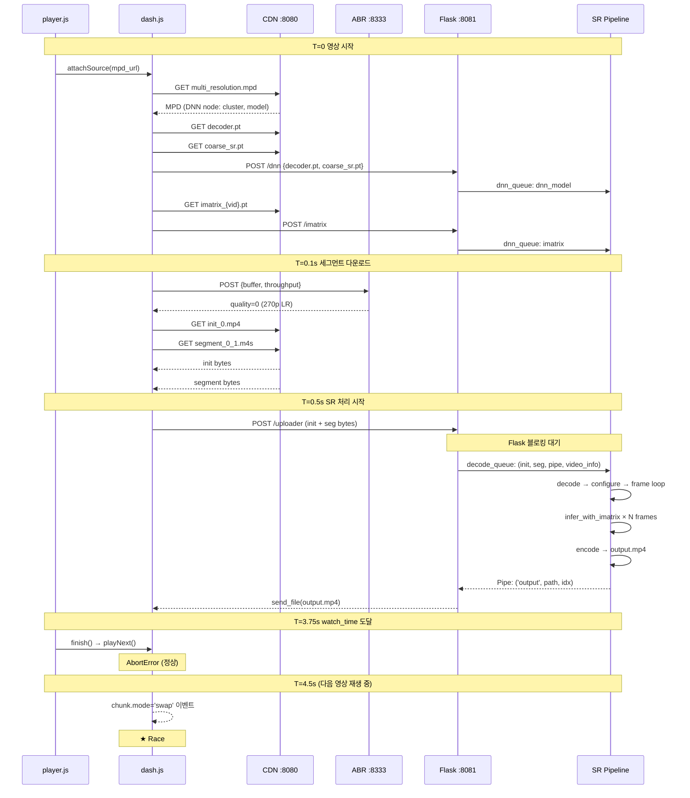

# 전송·재생·SR 파이프라인 타임라인 분석

> **대상**: 시스템 디버깅 및 race condition 파악  
> **기준 파일**: `player.js`, `dash.all.debug.js`, `dnn_appLocalServer.py`, `process.py`

---

## 1. 컴포넌트 맵 (전체 구조)

```
┌─────────────────────────────────────────────────────────────────────┐
│  Browser (Windows Chrome)                                           │
│                                                                     │
│  player.js          SuperPlayer (dash.js)                           │
│  ─────────          ─────────────────────────────                   │
│  sequence.json      ManifestLoader  → CDN :8080 (nginx)            │
│  playPtr / QUEUE_LEN ScheduleController → CDN :8080                │
│  watch_time          FragmentController → Flask :8081/uploader     │
│  finish() → playNext  AbrController   → ABR  :8333                │
│                                                                     │
└─────────────────────────────────────────────────────────────────────┘
         │ POST /uploader (segment bytes)     │ POST ABR state
         ▼                                   ▼
┌────────────────────┐            ┌─────────────────────┐
│  Flask :8081       │            │  ABR nginx :8333    │
│  dnn_appLocalServer│            │   → Python  :8334   │
│                    │            │   E-MPC quality     │
│  decode_queue ─────┤            └─────────────────────┘
│  (mp.Queue)        │
└────────────────────┘
         │
         ▼
┌─────────────────────────────────────────────────────────────────────┐
│  sr_process (mp.Process)  ←─── dnn_queue ←─── /dnn /imatrix        │
│                                                                     │
│  super_resolution_threading()                                       │
│  ├─ load_dnn_chunk thread    ← dnn_queue: dnn_model / imatrix      │
│  └─ process_video_chunk thread ← data_queue: configure/frame        │
│                                                                     │
│  decode_process (mp.Process)                                        │
│  └─ decode() → data_queue → process_video_chunk → encode_queue     │
│                                                                     │
│  encode_process (mp.Process)                                        │
│  └─ encode() → ffmpeg pipe → output.mp4 → Pipe → Flask → 브라우저  │
└─────────────────────────────────────────────────────────────────────┘
```

---

## 2. 단일 영상 재생 타임라인 (정상 흐름)

> 예: `Animal/SDR_Animal_3k7l`, duration=5s, watch_time=3.75s, segment_duration=4s

```
wall-clock  Browser (player.js + dash.js)              Flask SR Pipeline
──────────  ────────────────────────────────────────   ──────────────────────────────
T+0.00s     attachSource(mpd_url)                       (대기)
            ManifestLoader → GET MPD → CDN              
            DNN_STATE.byPlayerIdx[slot] 세팅             
                                                        
T+0.05s     MPD 파싱 완료                               
            → GET decoder.pt, coarse_sr.pt → CDN        
            → POST /dnn {decoder, coarse_sr}             → dnn_queue: dnn_model
                                                         load_dnn_chunk: model 교체
            → GET imatrix_{vid}.pt → CDN                
            → POST /imatrix                              → dnn_queue: imatrix
                                                         IMATRIX_STORE[vid] = imatrix
                                                        
T+0.10s     ABR: POST state → :8333 → quality 결정       
            GET segment_0_1.m4s (init)                   
            GET segment_0_2.m4s (seg#1, 0~4s)           
                                                        
T+0.50s     /uploader POST (init + seg#1 bytes)          → decode_queue.put(...)
            [SR pipeline 시작]                            decode: init+seg merge → input.mp4
                                                         decode: cv2.VideoCapture
                                                         decode: frame 0,1,2... → data_queue
                                                         process_video_chunk: infer_with_imatrix
                                                         encode: ffmpeg pipe write
                                                        
            [영상은 LR 원본으로 MSE 버퍼에 append]        
            [브라우저 재생 시작 ← LR 270p]               
                                                        
T+3.75s ★  finish('time') 호출                           [SR 파이프라인 진행 중...]
            playNext() → 다음 영상으로 switchToVideoElement  decode: frame ~100/120
            ← AbortError 발생 (이전 play() 인터럽트)     
            [AbortError는 예상된 정상 동작]               
                                                        
T+4.50s     (다음 영상 MPD 로드, segment 다운로드 등)    encode: ffmpeg 완료
                                                         encode_queue.put(('end', pipe))
                                                         → output.mp4 완성
                                                         → Flask: send_file(swap_file)
                                                        
T+5.00s     /uploader 응답 도착                          
            → 이미 다른 영상 재생 중                      
            → chunk.mode='swap' 이벤트 발생               
            → 재생 중인 영상에 잘못된 buffer 적용 위험 ★  
```

---

## 3. QUEUE_LEN=5 프리페치 큐 타임라인

```
시각  slot[0]           slot[1]           slot[2]           slot[3]           slot[4]
────  ────────────────  ────────────────  ────────────────  ────────────────  ──────────
T+0   vid_0 attachSrc   vid_1 attachSrc   vid_2 attachSrc   vid_3 attachSrc   vid_4 attachSrc
      MPD load          MPD load          MPD load          MPD load          MPD load
      DNN download      DNN download      DNN download
      ▼playing

T+3.75 finish(vid_0)
      playNext()
                        ▼playing
      vid_5 attachSrc ──────────────────────────────────────────────────────── → slot[0] 재활용

T+7.5  finish(vid_1)
                                          ▼playing
      vid_6 attachSrc

  ...
```

**핵심 문제**: DNN 다운로드(decoder.pt ~수MB, imatrix ~수MB)와 SR 처리는 비동기지만,  
`/uploader` → `decode_queue` → 파이프라인은 **동기 블로킹** 구조.  
watch_time(3.75s) < segment_duration(4s)이므로 seg#1이 SR 완료되기 전에 영상 전환 발생.

---

## 4. AbortError 발생 메커니즘

```
player.js::finish()
  │
  ├─ player.playNext()
  │     │
  │     └─ SuperPlayer::playNext()
  │           │
  │           └─ switchToVideoElement(newElement)
  │                 │
  │                 └─ attachView()          ← 새 <video> 엘리먼트 연결
  │                       │
  │                       └─ initialize()
  │                             │
  │                             └─ play()   ← 새 영상 play() 호출
  │
  └─ [기존 영상 play() Promise가 아직 pending]
        │
        └─ Promise.catch(AbortError)
              │
              └─ logger.warn('Caught pending play exception...')  ← 콘솔 경고
```

**결론**: AbortError는 버그가 아님. Chrome 정책상 `play()` Promise는 `load()` 인터럽트 시  
AbortError로 reject됨. dash.js가 이미 catch해서 warn으로 처리 중. **무시해도 됨.**

---

## 5. SR 파이프라인 내부 타임라인 (프로세스/스레드 축)

```
프로세스/스레드             메시지 흐름
──────────────────────────  ─────────────────────────────────────────────────────────

Flask (main thread)         POST /uploader 수신
  │                         decode_queue.put((init_path, seg_path, pipe, video_info))
  │                         ← 블로킹: output_output.recv() 대기 ★★★
  │
  ▼
decode_process              decode_queue.get()
  │                         init + seg 병합 → input.mp4
  │                         data_queue.put(('process_dir', ...))
  │                         data_queue.join()  ← 블로킹
  │                         data_queue.put(('configure', scale, width, vid, class))
  │                         data_queue.join()  ← 블로킹
  │                         
  │  frame loop:
  │  ├─ shared_tensor_list[270][i % 120].copy_(lr_frame)
  │  └─ data_queue.put(('frame', frame_count))
  │
  │  data_queue.join()      ← 모든 frame SR 완료 대기
  │  encode_queue.join()    ← encode 완료 대기
  │  encode_queue.put(('end', pipe))
  │  encode_queue.join()
  │
  ▼
sr_process::process_video_chunk (thread)
  │                         data_queue.get('configure') → targetWidth, vid 세팅
  │                         data_queue.get('frame', N)
  │                         imatrix 조회
  │                         model.infer_with_imatrix(lr_prev, lr_curr, N)
  │                           ├─ coarse_sr(LR_triplet)    → x_coarse (1,3,1080,1920)
  │                           ├─ codebook lookup(imatrix) → z_q
  │                           └─ decoder(z_q, x_coarse)   → x_hat (1,3,1080,1920)
  │                         shared_tensor_list[1080][i % 120].copy_(x_hat)
  │                         encode_queue.put(('frame', idx))
  │                         data_queue.task_done()
  │
  ▼
encode_process              encode_queue.get('frame')
                            shared_tensor_list[1080][idx].cpu().numpy() → ffmpeg pipe
                            encode_queue.get('end')
                            ffmpeg flush → output.mp4
                            pipe.send(('output', output.mp4, infer_idx))

  ▲
  │
Flask (main thread)         output_output.recv() → ('output', path, idx)
                            send_file(path) → 브라우저로 SR 영상 전송
```

---

## 6. Race Condition 맵

```
Race #1: SR 완료 전 영상 전환
─────────────────────────────────────────────────────────────
  T         Browser                    Flask SR Pipeline
  ──────    ───────────────────        ─────────────────────
  T+0       seg#1 다운로드 완료
            POST /uploader(seg#1)  →→→ SR 시작 (블로킹)
  T+3.75    finish() → playNext()
            다음 영상 재생 시작
  T+4.5                            ←←← SR 완료: send_file()
            응답 도착 → chunk.mode='swap'
            ★ 지금 재생 중인 영상(vid_1)의 버퍼에
              vid_0의 SR 결과가 삽입될 수 있음

  → 확인 포인트: onFragmentLoadingCompleted의
    chunk.streamId !== streamId 체크 (line 35745)


Race #2: DNN 모델 미로드 상태에서 imatrix 수신
─────────────────────────────────────────────────────────────
  IMATRIX_STORE[vid] 세팅: /imatrix POST (비동기, 순서 불보장)
  model.load_model(): /dnn POST (비동기)

  → imatrix가 도착했어도 model이 구 클래스라면
    잘못된 모델로 imatrix 적용
  → ACTIVE_MODEL_CLASS vs IMATRIX_STORE[vid] 불일치 가능


Race #3: byPlayerIdx 세팅 타이밍 (수정됨)
─────────────────────────────────────────────────────────────
  [수정 전] DNN_STATE가 None → player.js byPlayerIdx 세팅 실패
           → ManifestLoader가 vid="Animal" (class만) 세팅
  [수정 후] player.js 상단에서 DNN_STATE 사전 초기화


Race #4: 동일 player slot 재사용
─────────────────────────────────────────────────────────────
  vid_5 attachSource → slot[0] 재사용
  ManifestLoader: if (!byPlayerIdx[0]) → 이미 있으면 스킵
  ★ vid_0의 오래된 ctx가 vid_5에 적용될 수 있음
  → 확인 포인트: ManifestLoader byPlayerIdx 덮어쓰기 조건
```

---

## 7. 현재 디버깅 로그로 파악 가능한 것 vs 불가능한 것

### 파악 가능 (현재 로그로)

| 로그 | 파악 가능 정보 |
|------|-------------|
| `[INIT] attachSource idx=%d pid=%s` | prefetch 큐 진행 순서 |
| `[DNN][SuperP] slot=%d vid=%s` | byPlayerIdx 세팅 시점 |
| `[ManifestLoader] playerId=%d` | getPlayerId() 반환값 확인 |
| `[DECODE-START] vid=%s quality=%d` | SR 파이프라인 진입 시점 |
| `[SR-CONFIG] vid=%s` | SR configure 수신 시점 |
| `[SR-INFER] mode=with_imatrix frame=%d` | 추론 시작 시점 |
| `[DNN-QUEUE] recv dnn_model class=%s` | 모델 교체 시점 |
| `[DNN-QUEUE] recv imatrix vid=%s` | imatrix 캐시 시점 |
| `decode [encode end]: %ssec` | 전체 SR 소요시간 |

### 파악 불가능 (추가 계측 필요)

| 알고 싶은 것 | 추가해야 할 것 |
|------------|--------------|
| seg 도착 ~ SR 완료 E2E 레이턴시 | Flask `/uploader` 진입 ~ `send_file` 타임스탬프 |
| 브라우저가 SR 응답을 실제로 사용했는지 | `chunk.mode='swap'` 이벤트 + `streamId` 매칭 로그 |
| 어떤 frame이 drop됐는지 | encode_process frame count vs decode frame count |
| imatrix vs 모델 클래스 불일치 | `ACTIVE_MODEL_CLASS != IMATRIX_STORE key` 체크 |
| race #1 실제 발생 여부 | `/uploader` 응답 시 `currentPid` vs `chunk.vid` 비교 |

---

## 8. 권장 디버깅 절차 (단계별)

```
Step 1. 타임스탬프 기반 E2E 추적
─────────────────────────────────────────────────────────────
  목표: "seg#N 도착 → SR 완료 → 브라우저 수신"까지 실시간 확인
  
  Flask /uploader:
    uploader_start = time.time()
    ... SR pipeline ...
    print(f'[E2E] vid={vid} seg={index} latency={time.time()-uploader_start:.2f}s')
  
  browser (dash.js onload):
    console.log('[RECV] seg=', chunk.index, 'vid=', chunk.vid, 
                'mode=', chunk.mode, 'ts=', Date.now())


Step 2. 플레이어 전환 시 SR 응답 정합성 확인
─────────────────────────────────────────────────────────────
  dash.js onFragmentLoadingCompleted (line 35880):
    console.log('[FC] streamId=', streamInfo.id, 
                'currentStream=', streamId, 
                'match=', streamInfo.id === streamId)
  
  → streamId 불일치 → Race #1 발생 확인


Step 3. 모델/imatrix 정합성 확인
─────────────────────────────────────────────────────────────
  process.py process_video_chunk frame 처리 전:
    if ACTIVE_MODEL_CLASS != current_class:
        print(f'[WARN] MODEL-CLASS MISMATCH: model={ACTIVE_MODEL_CLASS} vid_class={current_class}')


Step 4. Chrome DevTools Performance 탭
─────────────────────────────────────────────────────────────
  - Network 타임라인: MPD / segment / /uploader / /dnn / /imatrix 요청 순서 및 겹침
  - 빨간색 XHR = 실패, 긴 회색 bar = 대기 (SR 블로킹)
  - "/uploader" 요청의 Timing > Waiting (TTFB) = SR 처리 시간
```

---

## 9. Sequence Diagram (단일 영상 정상 흐름)



---

## 10. 현실적인 타임 버짓 분석

```
watch_time = 3.75s, segment_duration = 4s, fps = 30

seg#1: frame 0~119 (4s × 30fps)
SR per frame: ~30~50ms (GPU 추론 기준)
SR 전체 seg: 120 × 40ms = 4.8s

→ watch_time(3.75s) << SR 완료 시간(4.8s)
→ 브라우저가 다음 영상으로 넘어간 후 1초 뒤에 SR 응답 도착

실질적으로:
  - seg#1의 SR 결과는 100% race condition 발생
  - 브라우저가 이미 다음 영상 재생 중 → swap 불가 또는 잘못된 적용

해결 방향:
  A) watch_time을 더 길게 (≥ SR 완료 시간)
  B) SR을 segment 단위가 아닌 background 비동기로 처리
  C) SR 결과를 다음 재생에 캐싱 (같은 vid 재방문 시 사용)
  D) SR off (disableSRProcess) 후 E2E 레이턴시 측정 먼저
```

---

*생성일: 2026-04-04 | 기준 repo: Shorts_Codebook_Streaming_Testbed*
